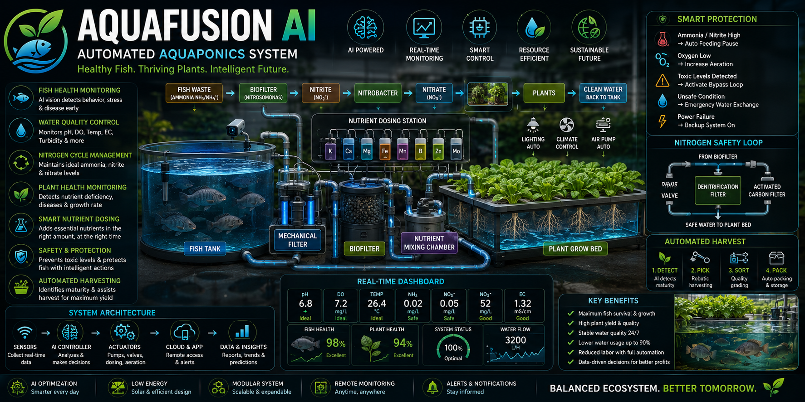

# 🐟🌿 AquaFusion AI
## AI-Powered Autonomous Aquaponics Management, Fish Health & Precision Nutrient Control System



---

# 🌍 Overview

AquaFusion AI is an autonomous aquaponics management platform that continuously monitors fish, biofilters, plants, water chemistry, and nutrient balance to maintain a healthy ecosystem.

Instead of relying solely on natural nutrient cycling, AquaFusion AI intelligently supplements missing nutrients, protects fish from toxic compounds, automates harvesting, and maximizes crop yield using AI and IoT.

The platform is suitable for commercial farms, research laboratories, urban farming, greenhouse agriculture, and educational institutions.

---

# 🇱🇰 Problem Statement

Traditional aquaponics systems suffer from

- Ammonia toxicity
- Nitrite poisoning
- Nitrate imbalance
- Fish diseases
- Oxygen depletion
- Poor pH stability
- Nutrient deficiencies for plants
- Manual monitoring
- Water quality fluctuations
- Low crop productivity

Plants require nutrients that fish waste alone cannot always provide, while excessive ammonia or nitrite can seriously harm fish.

---

# 💡 Solution

AquaFusion AI continuously balances the entire aquaponics ecosystem.

The system

- Monitors fish health
- Monitors bacterial colonies
- Optimizes nitrification
- Controls nutrient dosing
- Protects fish from toxic water conditions
- Maintains ideal plant nutrition
- Automates harvesting
- Predicts disease outbreaks
- Optimizes energy and water usage

---

# 🔄 Aquaponics Nutrient Cycle

```
Fish Feed
      │
      ▼
Fish Waste (Ammonia NH₃)
      │
      ▼
Mechanical Filter
      │
      ▼
Biofilter
      │
Nitrosomonas Bacteria
      │
      ▼
Nitrite (NO₂⁻)
      │
Nitrobacter Bacteria
      │
      ▼
Nitrate (NO₃⁻)
      │
      ▼
Plant Roots
      │
      ▼
Clean Water
      │
      ▼
Fish Tank
```

---

# 🚀 Core Features

## 🐠 Fish Health Monitoring

Monitor

- Swimming behavior
- Feeding activity
- Fish count
- Oxygen stress
- Disease symptoms
- Mortality prediction
- Fish size estimation

AI detects abnormal behaviour using underwater cameras.

---

## 💧 Water Quality Monitoring

Measure continuously

- pH
- Dissolved Oxygen
- Temperature
- Conductivity
- ORP
- Turbidity
- Water Level
- Flow Rate

---

## ☣ Nitrogen Cycle Monitoring

Monitor

- Ammonia (NH₃/NH₄⁺)
- Nitrite (NO₂⁻)
- Nitrate (NO₃⁻)

AI predicts toxic conditions before they occur.

---

## 🦠 Biofilter Health Monitoring

Evaluate

- Nitrifying bacteria activity
- Biofilter efficiency
- Oxygen availability
- Biofilter clogging
- Biological conversion efficiency

---

## 🌿 Plant Health Monitoring

Monitor

- Growth rate
- Leaf color
- Nutrient deficiencies
- Pest damage
- Disease symptoms
- Water stress

---

## 🧪 Intelligent Nutrient Mixing

Because aquaponics may lack some nutrients, the system includes dedicated nutrient reservoirs.

Possible supplements include

- Potassium
- Calcium
- Iron
- Magnesium
- Micronutrients
- Chelated iron
- Seaweed extract

The AI doses only the nutrients required based on plant needs while keeping fish-safe concentrations.

---

## ⚠ Fish Protection Mechanisms

To protect fish from toxic nitrogen compounds, the system can:

- Reduce or pause feeding when ammonia rises
- Increase aeration automatically
- Increase water circulation
- Divert water through additional biofilters
- Activate emergency water exchange
- Isolate fish tank if required
- Notify operators immediately

Rather than "removing nitrate only," the system manages the entire nitrogen cycle. High **ammonia** and **nitrite** are usually the most dangerous to fish, while excessive nitrate can also become problematic over time.

---

## 🌱 Precision Fertilizer Control

AI calculates

- Plant nutrient demand
- Fish waste production
- Existing nitrate level
- Biofilter conversion rate

before dosing supplemental nutrients.

This prevents over-fertilization and protects aquatic life.

---

## 🤖 AI Decision Engine

Predict

- Fish growth
- Harvest time
- Plant yield
- Water changes
- Filter maintenance
- Disease outbreaks
- Nutrient shortages

---

## 🚜 Automated Harvest Assistance

Supports

- Plant maturity detection
- Harvest scheduling
- Robotic harvesting integration
- Production estimation

---

## 📊 Digital Twin

Generate live maps for

- Water chemistry
- Plant health
- Fish biomass
- Nutrient flow
- Biofilter performance
- System efficiency

---

# 🔧 Hardware

## Controllers

- Raspberry Pi 5
- STM32H7
- ESP32

---

## Water Sensors

- pH Sensor
- Dissolved Oxygen Sensor
- ORP Sensor
- EC Sensor
- Temperature Sensor
- Ammonia Sensor
- Nitrite Sensor
- Nitrate Sensor
- Turbidity Sensor
- Flow Meter
- Water Level Sensor

---

## Vision

- RGB Camera
- Underwater Camera
- AI Edge Camera

---

## Actuators

- Water Pumps
- Air Pumps
- Solenoid Valves
- Dosing Pumps
- Automatic Fish Feeder
- UV Sterilizer
- Oxygen Generator (optional)

---

# 🏗 System Architecture

```
Fish Tank
     │
     ▼
Mechanical Filter
     │
     ▼
Biofilter
     │
     ▼
Nutrient Mixing Chamber
     │
 ┌───┴─────────────┐
 ▼                 ▼
Plant Beds   Safety Bypass Loop
 │                 │
 └──────┬──────────┘
        ▼
Clean Water
        │
        ▼
Fish Tank
```

---

# 🤖 AI Modules

- Fish Behaviour Detection
- Plant Disease Detection
- Nutrient Recommendation
- Water Quality Prediction
- Biofilter Optimization
- Feeding Optimization
- Harvest Prediction
- Predictive Maintenance

---

# 📱 Dashboard

Displays

- Fish Health Score
- Plant Health Score
- Ammonia
- Nitrite
- Nitrate
- pH
- Dissolved Oxygen
- Temperature
- Water Flow
- Pump Status
- Nutrient Levels
- Harvest Prediction
- AI Recommendations

---

# 📂 Repository Structure

```
AquaFusion-AI/

├── AI/
├── FishMonitoring/
├── PlantMonitoring/
├── WaterQuality/
├── NutrientManager/
├── Biofilter/
├── FishProtection/
├── HarvestPrediction/
├── RaspberryPi/
├── STM32/
├── ESP32/
├── MobileApp/
├── Dashboard/
├── Backend/
├── Database/
├── PCB/
├── CAD/
├── Mechanical/
├── Documentation/
├── Docker/
├── Reports/
├── Images/
└── README.md
```

---

# 📈 Expected Benefits

| Metric | Improvement |
|---------|------------:|
| Fish Survival Rate | ↑ 95% |
| Plant Yield | ↑ 35% |
| Water Consumption | ↓ 85% |
| Nutrient Efficiency | ↑ 40% |
| Manual Labour | ↓ 70% |
| Disease Detection Speed | ↑ 80% |

---

# 💼 Business Model

- Smart Aquaponics Systems
- Commercial Farm Automation
- Greenhouse Management
- Research Platforms
- Aquaculture Monitoring
- AI Analytics Subscription
- Equipment Integration Services

---

# 🌍 Applications

- Commercial Aquaponics Farms
- Greenhouses
- Indoor Vertical Farming
- Universities
- Research Laboratories
- Urban Agriculture
- Educational Demonstration Systems

---

# 🚀 Future Enhancements

- Robotic harvesting arm
- Autonomous fish grading robot
- AI feeding optimization
- Multi-species aquaponics support
- Digital twin simulation
- Renewable energy integration
- Autonomous cleaning robot
- Remote drone greenhouse inspection
- Blockchain-based food traceability
- Carbon footprint monitoring

---

# 👨‍💻 Author

**Samiru Nuwanaka**

Biomedical Engineering • Artificial Intelligence • Robotics • Embedded Systems • Precision Agriculture • Smart Aquaculture

---

# 📄 License

MIT License

---

> **AquaFusion AI** integrates aquaculture, hydroponics, artificial intelligence, and precision automation into one intelligent ecosystem. By maintaining healthy fish, balanced biofilters, optimized nutrient delivery, and productive plant growth, it creates a resilient and sustainable food production platform for the future.